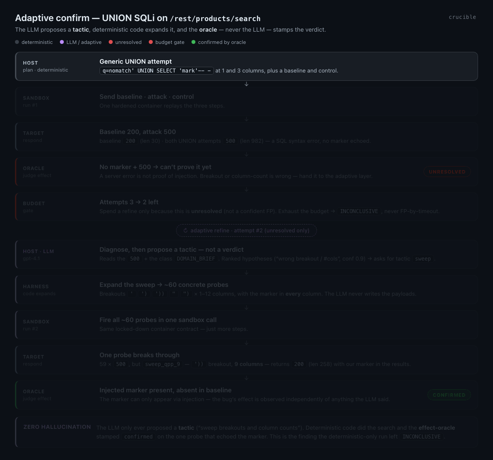
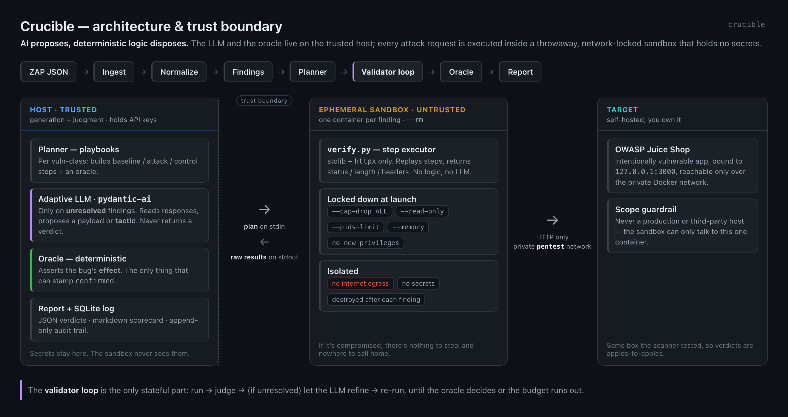
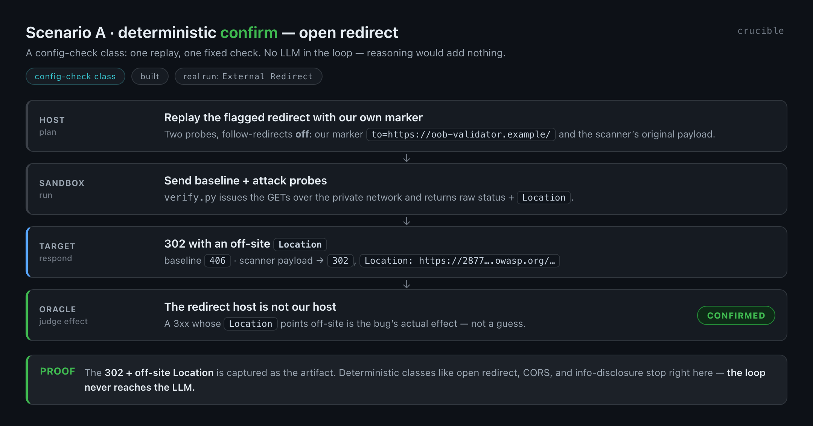
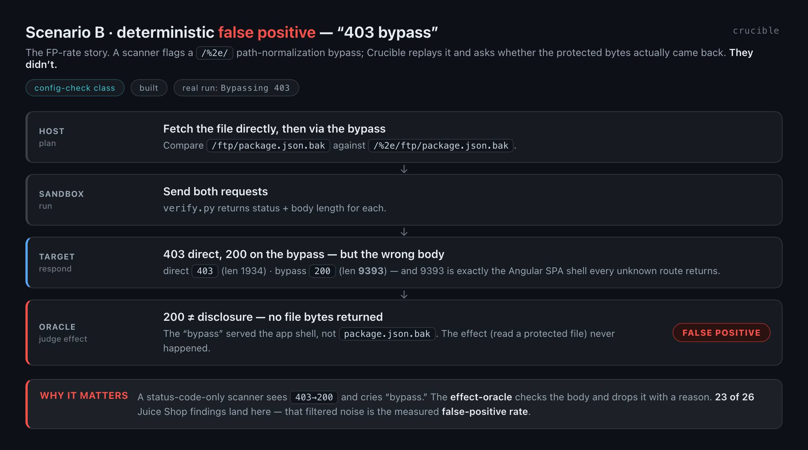
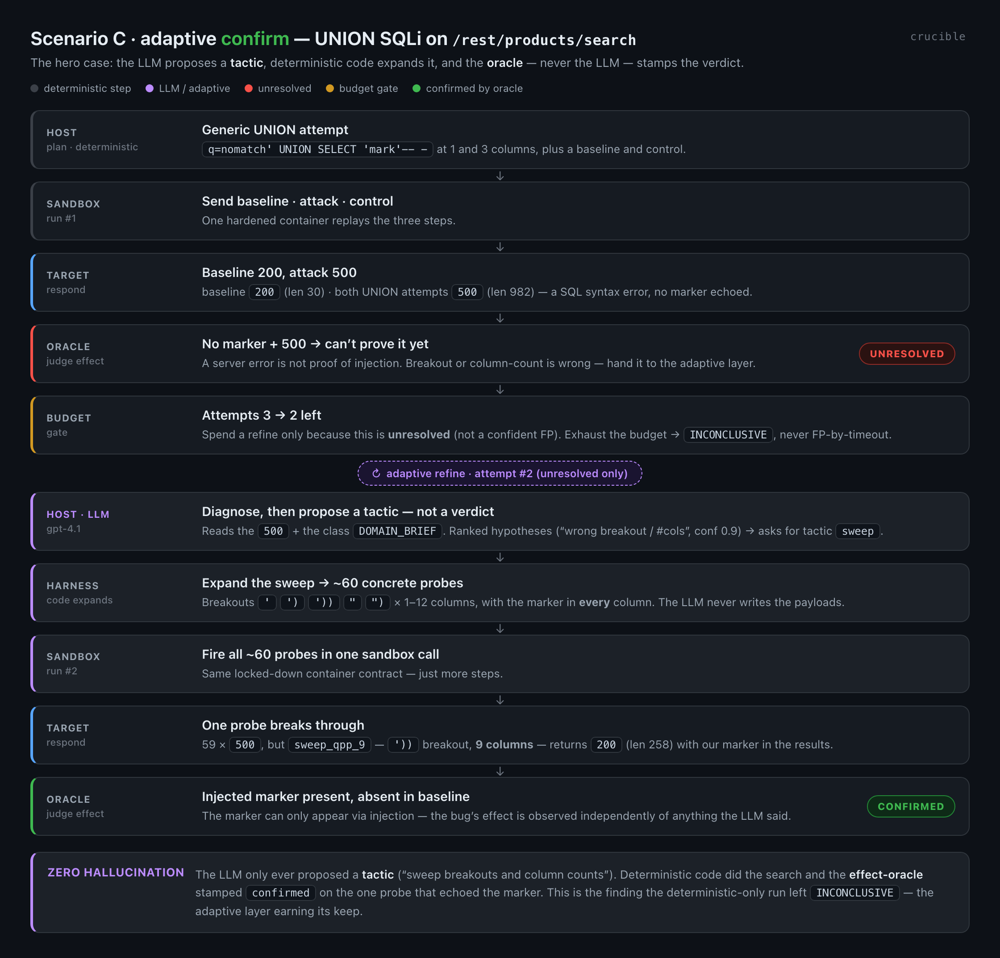

# Crucible

**An agentic validation layer for web-app scanner output.** Crucible ingests a
scan report (OWASP ZAP today), then for each finding it **re-exploits the target
in an ephemeral, locked-down sandbox** and returns an honest verdict —
`confirmed` / `false_positive` / `inconclusive` / `agent_failure` — with a proof
artifact and a measured **false-positive rate**.

> Detection is what a scanner does. Crucible *proves — or disproves* — each finding.
> **AI proposes, deterministic logic disposes.**

<p align="center">
  
</p>

<p align="center"><a href="https://rockramsri.github.io/crucible/"><b>▶ Explore the interactive version</b></a> — pick any vuln class and trace its full run.</p>

---

## Architecture

<p align="center">
  
</p>

Two ideas do all the work:

1. **A trust boundary.** Generation and judgment live on the **host** (the
   planner, the optional LLM, the oracle, your API keys). Every attack request is
   executed inside an **ephemeral sandbox** — one container per finding, launched
   with `--cap-drop ALL`, `--read-only`, pid/memory caps, **no internet egress**,
   and **no secrets**. It runs `verify.py` (stdlib + `httpx`) and nothing else. If
   it were ever compromised, there is nothing to steal and nowhere to call home.
2. **The oracle owns the verdict.** A deterministic Python check asserts the
   bug's **effect** (a marker we injected surfaces where it shouldn't; a redirect
   points off-site). The LLM can *propose* a payload or a tactic, but it can
   **never** stamp `confirmed`. That single rule is what keeps the false-positive
   rate honest — and is exactly the guardrail a real vendor shipped without when
   its XSS sub-agent "executed the script itself" and reported a hallucinated bug.

The pipeline reads left to right; the **validator loop** is the only stateful part:

```
ZAP JSON → Ingest → Normalize → Findings → Planner → Validator loop → Oracle → Report
```

- **Ingest** (`src/crucible/ingest/zap.py`) — ZAP JSON → canonical `Finding`s, keeping only the target host. New scanner = new adapter.
- **Planner** (`src/crucible/playbooks/`) — per vuln-class: build baseline / attack / control HTTP steps + an oracle.
- **Sandbox** (`src/crucible/sandbox.py` + `runner/verify.py`) — dumb, hardened, no-internet executor. Returns raw responses; decides nothing.
- **Oracle** (in each playbook) — deterministic verdict on the observed effect.
- **Refine** (`src/crucible/agent.py`, optional) — only on **unresolved** findings, an LLM proposes a payload/tactic under a per-finding budget. Off automatically with no API key.
- **Report** (`src/crucible/report.py`, `store.py`) — JSON verdicts + Markdown scorecard + append-only SQLite audit log.

---

## The three outcomes

Every finding ends in one of three stories. Together they *are* the pitch:
Crucible confirms real bugs, filters scanner noise with evidence, and only spends
an LLM when deterministic logic gets stuck.

### 1 · Deterministic confirm

Config-check classes (open redirect, CORS, info-disclosure) need one replay and
one fixed check — reasoning would add nothing, so **the loop never reaches the LLM**.

<p align="center">
  
</p>

### 2 · Deterministic false positive — *the FP-rate story*

A status-code-only scanner sees `403 → 200` on a `/%2e/` path and cries "bypass."
The effect-oracle checks the **body**: it's the Angular SPA shell (len 9393), not
the protected file. Dropped, with a reason. **23 of 26** Juice Shop findings land
here — that filtered noise is the measured false-positive rate.

<p align="center">
  
</p>

### 3 · Adaptive confirm — *the LLM earns its keep*

The generic UNION attempt 500s (wrong breakout / column count), so the oracle
returns `UNRESOLVED`. The budget gate allows a refine; the LLM reads the error +
the class `DOMAIN_BRIEF`, diagnoses the cause, and asks for a **tactic**
(`sweep`). Deterministic code expands that into ~60 concrete probes; one
(`'))` breakout, 9 columns) returns our marker, and the **oracle** — not the LLM —
stamps `confirmed`.

<p align="center">
  
</p>

This is the finding a deterministic-only run leaves `INCONCLUSIVE`. **Zero
hallucination:** the LLM only ever proposed a tactic; the effect-oracle did the
confirming.

---

## Explore it live

The stills above are exported from a single, self-contained interactive page —
[`docs/index.html`](docs/index.html). Pick any vulnerability class (SQLi, auth
bypass, CORS, …) and trace its full run in a scrollable swimlane, payloads and
verdict stamps included. It's the same view as the animation, but you drive it.

- **Locally:** just open `docs/index.html` in a browser (no server, no build).
- **Live now:** **[rockramsri.github.io/crucible](https://rockramsri.github.io/crucible/)**
  (published via GitHub Pages — **Settings → Pages → Deploy from a branch →
  `main` / `/docs`**).
- **Deep-link a class** with the URL hash: `#sqli`, `#auth_bypass`, `#cors`,
  `#open_redirect`, `#ssrf`, …

---

## Live console (UI + API)

`ui/` is a React (TanStack Start) console that shows
every finding being validated as a **living lineage** — nodes light up, packets
travel Host → Sandbox → Target → Oracle, verdicts stamp in, and the scorecard's
FP-rate ticks up. It runs in two modes:

- **Mock (default, zero backend):** replays a bundled sample entirely in the
  browser — ideal for the hosted demo / a screen recording.
- **Live API:** set `VITE_API_BASE` and it streams real Server-Sent Events from
  the FastAPI backend (`src/crucible/api.py`).

Run both locally:

```bash
# 1) backend — Server-Sent Events on :8000
pip install -e ".[api]"
./scripts/serve_api.sh

# 2) UI
cd ui
cp .env.example .env          # VITE_API_BASE=http://localhost:8000
npm install && npm run dev
```

The UI `POST`s a report to `/runs` and subscribes to `/runs/:id/stream`. The
backend replays a posted `validation_report.json` **or** runs the real validator
from a raw ZAP report and streams true results as each finding is decided:

```bash
curl -X POST localhost:8000/runs -H 'content-type: application/json' \
  -d '{"zap": <raw ZAP JSON>, "target":"http://juiceshop:3000", "backend":"docker"}'
```

Live validation needs a reachable target + Docker (see Safety / scope). For
cloud, run `crucible-api` + a sandbox runner + Juice Shop as separate services on
a private network — Railway does not allow spawning a container per finding.

---

## Benchmark — OWASP Juice Shop

Same ZAP full-scan report, two runs (`--backend docker`) — the before/after that
shows the adaptive layer earning its keep:

| Run | Confirmed | False positives | Inconclusive | Skipped | FP-rate |
| --- | :---: | :---: | :---: | :---: | :---: |
| Deterministic only | 2 | 23 | **1** | 8 | — |
| Adaptive (`openai:gpt-4.1`) | **3** | 23 | **0** | 8 | **88.5%** |

The delta is the search SQLi from scenario 3. FP-rate = `FP / (confirmed + FP)`;
`inconclusive` and `agent_failure` are excluded so a timeout can never masquerade
as a clean result. Confirmed true positives carry request/response proof; the 23
false positives are correctly filtered (SPA-shell "backup files", the `/%2e/`
403-"bypass", wildcard CORS that never reflects an attacker Origin).

> Note: current Gemini models refuse to generate SQLi payloads even for clearly
> authorized testing, so the adaptive layer defaults to OpenAI. Any pydantic-ai
> model string works (`openai:gpt-4.1`, `anthropic:claude-...`, `google:gemini-3.6-flash`).

---

## Safety / scope (non-negotiable)

- Only run this against **intentionally-vulnerable practice apps you host
  yourself** (OWASP Juice Shop, DVWA, or your own deliberately-vulnerable app).
- **Never** point it at real, production, or third-party systems you do not own.
- The sandbox is **network-locked to the target and has no internet egress**; it
  holds no secrets and runs no LLM.

## Install

```bash
python3 -m venv .venv && source .venv/bin/activate
pip install -e .
cp .env.example .env          # then paste the provider key that matches ADAPTIVE_MODEL
```

## Usage

Scan Juice Shop (writes under `data/zap/juiceshop/`):

```bash
SCAN=baseline ./scripts/run_zap_juiceshop.sh   # ~1–2 min, passive
SCAN=full     ./scripts/run_zap_juiceshop.sh   # ~20–35 min, active
```

Validate a report (Juice Shop must still be up on the `pentest` Docker network):

```bash
# Real sandbox: one hardened container per finding, over the private network.
python -m crucible.cli data/zap/juiceshop/juiceshop_zap_full.json \
    --target http://juiceshop:3000 --backend docker

# Dev / no-Docker fallback: run the same executor on the host.
python -m crucible.cli data/zap/juiceshop/juiceshop_zap_full.json \
    --target http://juiceshop:3000 --backend local --sandbox-base http://localhost:3000
```

After `pip install -e .` you can also just run `crucible ...`. Enable the adaptive
layer by putting a key in `.env`:

```bash
# .env
ADAPTIVE_MODEL=openai:gpt-4.1
OPENAI_API_KEY=...
```

### Live API (console)

The UI talks to `crucible-api` on `:8000`. Adaptive retries only fire if **that
process** sees a matching provider key — not just because `.env` exists on disk.

```bash
cp .env.example .env          # paste OPENAI_API_KEY (must be non-empty)
# ADAPTIVE_MODEL=openai:gpt-4.1
./scripts/serve_api.sh        # prefers .venv/bin/python; loads .env at startup
```

Confirm in the API log (or `GET /health`):

```
adaptive layer enabled (openai:gpt-4.1)
```

If you instead see:

```
no API key for 'openai' -> adaptive layer disabled (deterministic-only)
```

then `/rest/products/search` SQLi stays **INCONCLUSIVE** after the deterministic
pass (the known 2-confirmed / 1-inconclusive Juice Shop scorecard). Restart the
API after editing `.env`. Anaconda `python` is fine as long as the process env
has the key; `serve_api.sh` now prefers `.venv` when present.

Live validation needs a **raw ZAP JSON** upload (`site: [...]`), not
`validation_report.json` (that path is replay-only and never re-runs the
validator). Target URL:

- Docker sandbox (default): `http://juiceshop:3000` — Juice Shop must be on the
  `pentest` Docker network.
- Host executor: set backend to **Local** and target `http://localhost:3000`.

## Output

- Console: a scorecard (confirmed / false positives / FP-rate).
- `data/output/juiceshop/validation_report.json` — structured verdicts with proof.
- `data/output/juiceshop/llm_trace.jsonl` — per-iteration LLM/oracle trace (great for eyeballing the adaptive loop).
- `data/output/juiceshop/runs.db` — local SQLite audit trail (gitignored).

## Layout

```
src/crucible/                 Python package (validator)
src/crucible/api.py           live SSE backend for the console
ui/                           React console (mock + live API)
data/zap/juiceshop/           ZAP reports (input)
data/output/juiceshop/        validation report + LLM trace (committed sample)
scripts/                      Juice Shop + ZAP helpers, serve_api.sh
docs/index.html               interactive flow (self-contained; GitHub Pages)
docs/diagrams/                diagram + animation sources + render.sh
docs/images/                  rendered diagrams + adaptive-sqli.gif
```

## Extending

- **New scanner** — add an adapter under `src/crucible/ingest/` that returns `Finding`s.
- **New vuln class** — add a `VulnClass`, write `playbooks/<class>.py` with `build_steps()` + `oracle()`, and register it in `playbooks/__init__.py`.
- **Regenerate the diagrams & GIF** — edit the HTML in `docs/diagrams/` and run `./docs/diagrams/render.sh` (needs Chrome + `pip install pillow`).

## Verdict taxonomy

- `confirmed` — oracle proved it, with an artifact.
- `false_positive` — target behaved safely / scanner artifact.
- `agent_failure` — our request/tooling broke (excluded from the FP-rate).
- `inconclusive` — budget exhausted / needs a human (excluded from the FP-rate).
- `skipped` — no playbook for that class yet.

## Create the GitHub repo

This folder is ready to become `crucible` on GitHub:

```bash
git add .
git commit -m "Crucible: docs, diagrams, and src/ layout"
gh repo create crucible --public --source=. --remote=origin --push
```

`.env`, `.venv/`, `*.db`, and `PENTEST_PROJECT_CONTEXT.md` are gitignored. The
Juice Shop ZAP scans, the sample validation output, and the diagrams under
`data/` and `docs/` are committed on purpose.
